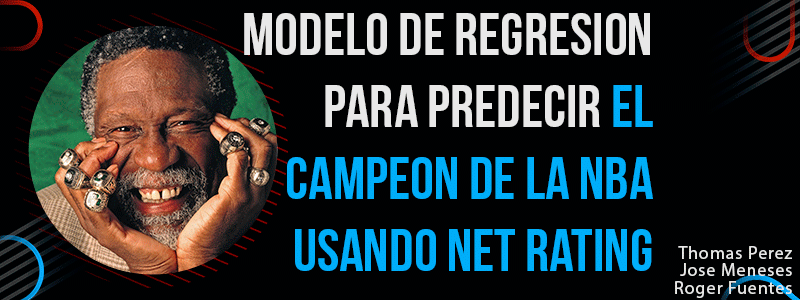

# 🏀 Predicción del Campeón de la NBA Usando Net Rating

  

## 👥 Autores
- **Thomas Perez**  
- **Jose Meneses**  
- **Roger Fuentes**

---

## 🎯 Objetivo

El objetivo de este proyecto es desarrollar un modelo de **regresión supervisada** capaz de estimar la probabilidad de que un equipo de la NBA se convierta en campeón utilizando la métrica avanzada **Net Rating**.  
A través de análisis exploratorio, visualizaciones, técnicas de limpieza de datos y modelos predictivos, buscamos determinar si el Net Rating es un indicador confiable del éxito en playoffs.

---

## 🗂️ Dataset

Este proyecto utiliza el siguiente conjunto de datos público:

🔗 **NBA/ABA/BAA Stats Dataset – Kaggle**  
https://www.kaggle.com/datasets/sumitrodatta/nba-aba-baa-stats?select=Team+Summaries.csv

Incluye estadísticas históricas de equipos como:
- Net Rating  
- Offensive Rating  
- Defensive Rating  
- Wins / Losses  
- Datos agregados por temporada

---

## 🤖 Modelos Usados

En el desarrollo del proyecto se emplearon los siguientes modelos de Machine Learning:

- **DecisionTreeRegressor** – Árbol de regresión.
- **RandomForestRegressor** – Bosques aleatorios probando distintos n_estimators.
- **SVR (Support Vector Regressor)** – Con kernels: `linear`, `poly`, `rbf`.
- **Red Neuronal (TensorFlow / Keras)** – Modelo denso con múltiples capas y activación ReLU.

Todos los modelos fueron evaluados utilizando MAE, MSE y validación cruzada cuando correspondía.

---

## 📓 Notebook de Google Colab

🔗 **Colab del proyecto:**  
https://colab.research.google.com/drive/1kBqrK3vvokUMoc_B3PssFG2oYZmP6Sn4?usp=sharing

## 🎬 Video Explicativo

🔗 **Presentación del proyecto (video):**  
*Enlace próximamente*

---
